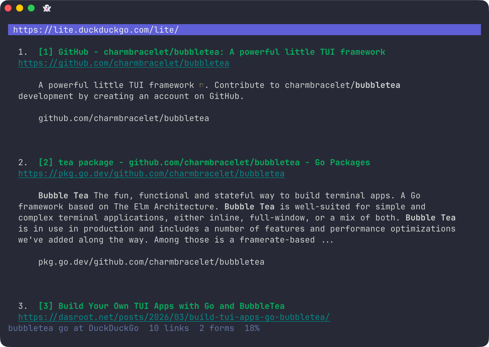

# fruit-jam 🍓

A terminal web browser that converts HTML pages to Markdown and renders them with [Glamour](https://github.com/charmbracelet/glamour). Clean, readable, uniform output regardless of how the source HTML is structured.

<figure>
    
</figure>

Built with [Bubbletea](https://github.com/charmbracelet/bubbletea).

## How it works

```
  user input (CLI arg or URL bar)
          │
          ▼
  ┌───────────────┐
  │ fetch.Get/Post│   net/http, UA: "fruit-jam/0.1 (like Lynx/2.9.0)"
  └───────┬───────┘   → sites serve text-browser HTML (e.g. DDG Lite)
          │ raw HTML
          ▼
  ┌──────────────────────────┐
  │ render.HTMLToPage        │
  │  ├─ html-to-markdown     │   <tr> registered as block →
  │  │   (+ commonmark)      │   layout tables render one row per line
  │  ├─ link numbering       │   [text](url) → [[1] text](url)
  │  └─ form extraction      │   golang.org/x/net/html
  └───────┬──────────────────┘
          │ Page{Markdown, Links, Forms, Title}
          ▼
  ┌───────────────┐
  │ Glamour       │   Markdown → ANSI, word-wrapped to viewport width
  └───────┬───────┘
          │ ANSI string
          ▼
  ┌───────────────┐
  │ Bubbletea     │   viewport + URL bar + status + form panel
  │  (Update/View)│   key handlers for g/G/f/i//n/N/h/r/?/q
  └───────────────┘
```

The browser identifies itself as a Lynx-like client so sites serve lightweight, text-browser-friendly HTML (e.g. DuckDuckGo redirects to DDG Lite). Links are extracted and numbered inline (`[[1] text](url)`) so you can follow (`f`) them without leaving the keyboard.

## Install

```sh
git clone https://github.com/lukas/fruit-jam
cd fruit-jam
go build -o fruit-jam ./cmd/fruit-jam
```

## Usage

```sh
fruit-jam https://example.com
fruit-jam duckduckgo.com        # https:// is assumed
fruit-jam                      # opens empty, press g to enter a URL
```

## Keybindings

| Key | Action |
|-----|--------|
| `g` / `Ctrl+L` | Open URL bar (empty — for a new URL) |
| `G` | Open URL bar pre-filled with current URL (for editing) |
| `Enter` | Navigate to URL |
| `Esc` | Cancel URL edit |
| `f` + number + `Enter` | Follow a numbered link |
| `/` | Search this page |
| `n` / `N` | Next / previous match |
| `i` | Fill a form on the current page |
| `r` | Reload |
| `h` / `Backspace` | Go back |
| `j` / `k` | Scroll down / up |
| `PgDn` / `PgUp` | Page down / up |
| `?` | Toggle help |
| `q` / `Ctrl+C` | Quit |

## Limitations

- No JavaScript execution
- No cookies or sessions
- Images are stripped (alt text shown where available)
- Some complex page layouts may not convert cleanly
- No highlighting searched text
